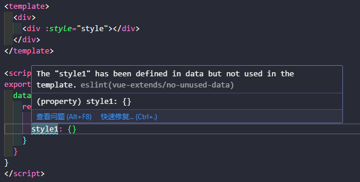
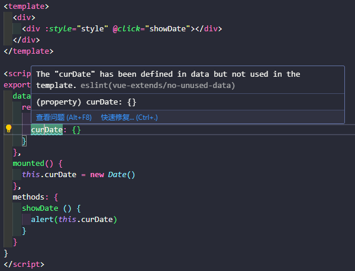

# eslint-plugin-vue-extends

This plugin is an extension of eslint-plugin-vue

## Installation

You'll first need to install [ESLint](https://eslint.org/):

```sh
npm i eslint --save-dev
```

Next, install `eslint-plugin-vue-extends`:

```sh
npm install eslint-plugin-vue-extends --save-dev
```

## Usage

Add `vue-extends` to the plugins section of your `.eslintrc` configuration file. You can omit the `eslint-plugin-` prefix:

```json
{
    "extends": [
        "plugin:vue-extends/recommended"
    ]
}
```

## Rules

* `no-unused-data`: This rule reports data that haven't been used in the template



